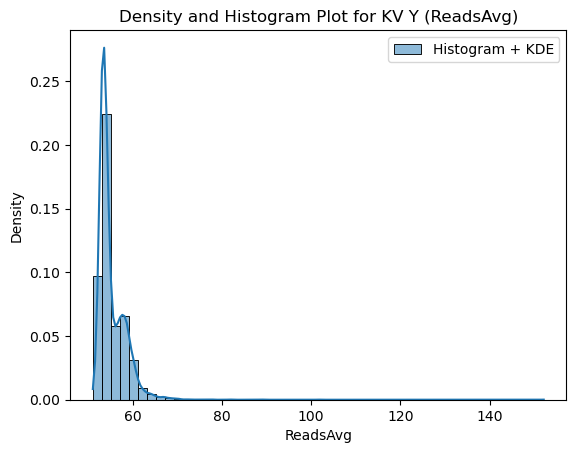
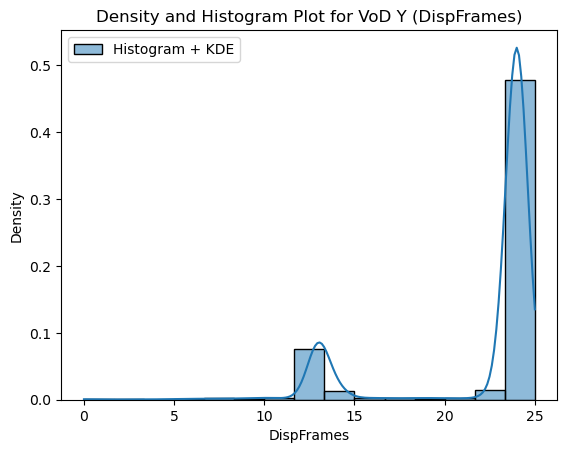
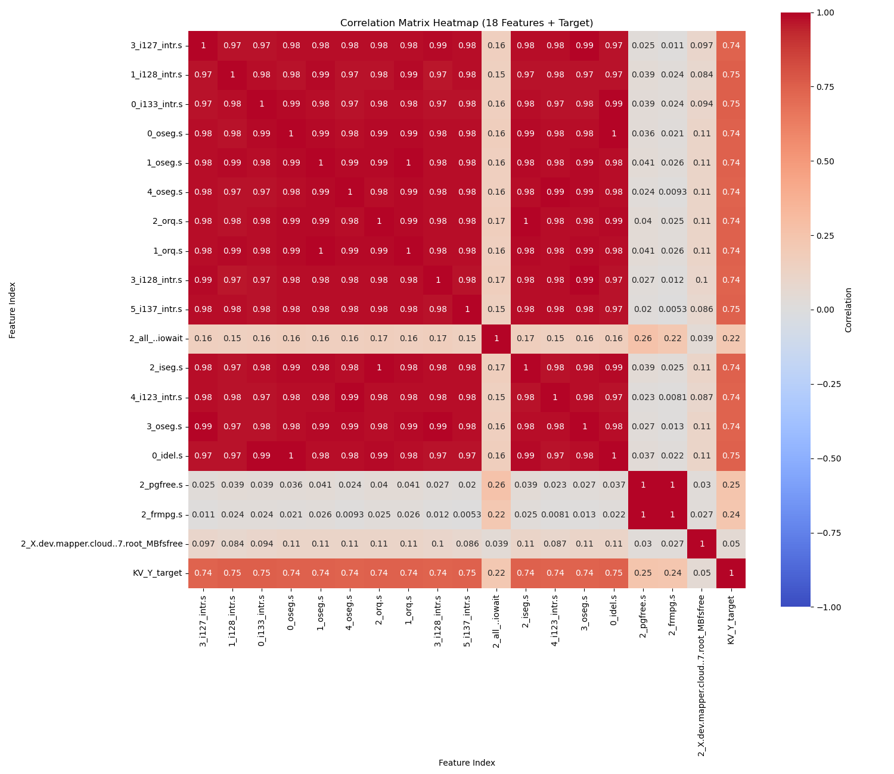
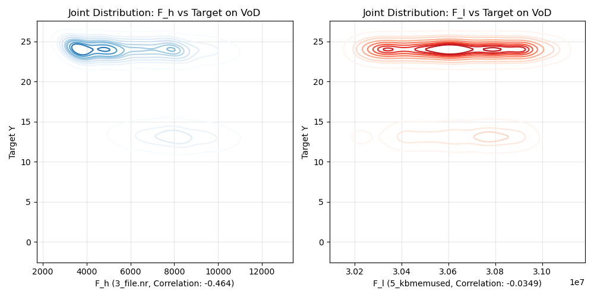

# EP2420 Report: Project1, Task I

## Author: Yiyi Miao, 2025/10/31

### Dataset:  

2025_JNSM_VoD_flashcrowd_2, 2025_JNSM_KV_flashcrowd_2

---

1. - Describe the design matrix X0 in terms of the number of sample rows, and the number of feature columns.
       1. Design Matrix KV $X_0$:
       Number of sample rows: 18317
       Number of feature columns: 1670
       2. Design Matrix VoD $X_0$:
       Number of sample rows: 18317
       Number of feature columns: 1670
   - For the target values Y, compute the mean, standard  deviation, maximum, minimum, 25th percentile, 50th percentile, and 95th percentile.
       1. Target KV Y Statistics:
            - Mean: 55.3
            - Standard Deviation: 3.13
            - Maximum: 152
            - Minimum: 51.1
            - 25th Percentile: 53.3
            - 50th Percentile: 54.1
            - 95th Percentile: 60.5
       2. Target VoD Y Statistics:
            - Mean: 22
            - Standard Deviation: 4.33
            - Maximum: 25
            - Minimum: 0
            - 25th Percentile: 24
            - 50th Percentile: 24
            - 95th Percentile: 24
   - The density and histogram plots on the same figure for the target values:
     - 
     - 


2. Produce six design matrices $X_1,X_2,...,X_6$ in form of numpy arrays using following code:

```
KV_X_1 = normalize(KV_X0, norm='l2', axis=0)
KV_X_2 = normalize(KV_X0, norm='l2', axis=1)
KV_X_3 = MinMaxScaler().fit_transform(KV_X0)
KV_X_4 = MinMaxScaler().fit_transform(KV_X0.T).T
KV_X_5 = StandardScaler().fit_transform(KV_X0)
KV_X_6 = StandardScaler().fit_transform(KV_X0.T).T

VoD_X_1 = normalize(VoD_X0, norm='l2', axis=0)
VoD_X_2 = normalize(VoD_X0, norm='l2', axis=1)
VoD_X_3 = MinMaxScaler().fit_transform(VoD_X0)
VoD_X_4 = MinMaxScaler().fit_transform(VoD_X0.T).T
VoD_X_5 = StandardScaler().fit_transform(VoD_X0)
VoD_X_6 = StandardScaler().fit_transform(VoD_X0.T).T
```

3. The heatmap of the correlation matrix are shown as follows.

The matrix is symmetric with diagonal values of 1.0 representing perfect self-correlation. The color intensity indicates correlation strength, with warmer colors (red) showing positive correlations and cooler colors (blue) showing negative correlations.

- KV Dataset:
  - **High Multicollinearity**: The map is overwhelmingly red. This indicates that most of the 18 selected features are strongly and positively correlated with each other. The high degree of correlation between features (multicollinearity) suggests that many features contain redundant information.
  - There are a few distinct horizontal and vertical stripes of a lighter color (e.g., around feature indices 8, 10, 12), showing that these specific features have a low or negative correlation with the other features.
  - The last row/column shows correlations between features and the target *ReadsAvg*. Several features exhibit strong positive correlations with target, indicating their high predictive value.

<p align="center">

</p>

- VoD Dataset:
  - **Complex Correlations**: Unlike the KV map, the VoD map shows a much more complex structure with a mix of dark red (strong positive correlation), dark blue (strong negative correlation), and white (near-zero correlation). This dataset has a more complex feature space.
  - The correlations with target *DispFrames* show more variation compared to KV. Some features show positive correlations in red, while others show near-zero or negative correlations in blue, indicating diverse predictive relationships.


<p align="center"></p>
<!--[Alter text](task1_VoD_correlation_heatmap.png)-->
4. Choose two features, one with the highest correlation $F_h$ (close to 1) with the target and one with the lowest correlation $F_l$ (close to 0). The joint distribution for $F_h$ and the target $Y$, the joint distribution for $F_l$ and the target $Y$ are shown as follows:

- KV Dataset:
  - High Correlation ($F_h$, Corr: 0.754): This plot shows a clear positive relationship. The dark blue areas form a pattern that slopes up and to the right. As $F_h$ increases, the Target Y value also tends to increase. This strong, predictable pattern is why $F_h$ is a good predictor.
  - Low Correlation ($F_l$, Corr: 0.219) : This plot shows no discernible pattern. The data is concentrated in a single, tight vertical blob at the far left. There is no visible trend or change in Target Y as $F_l$ increases. This confirms that $F_l$ is a poor predictor, as its value provides no information about the target's value.


- VoD Dataset:
  - High Correlation ($F_h$, Corr: -0.464): This plot shows a clear negative relationship. When $F_h$ is low (e.g., ~4000), the Target Y is high (clustered near 25). When $F_h$ is high (e.g., ~9000), the Target Y is low (clustered near 13). This strong inverse pattern is what the negative correlation value signifies.
  - Low Correlation ($F_l$, Corr: -0.0349): This plot shows no relationship at all. It essentially looks like two horizontal bars. The value of $F_l$ (along the x-axis) has no influence on the Target Y (y-axis). Whether Y is in the high cluster (~24) or the low cluster (~13) is completely independent of the value of $F_l$. This is a perfect visual example of a feature with near-zero correlation.


From an engineering perspective, $F_h$ likely represents a key performance indicator (e.g., CPU utilization or I/O activity) that directly impacts the service metric, while $F_l$ corresponds to a secondary metric with negligible influence.
